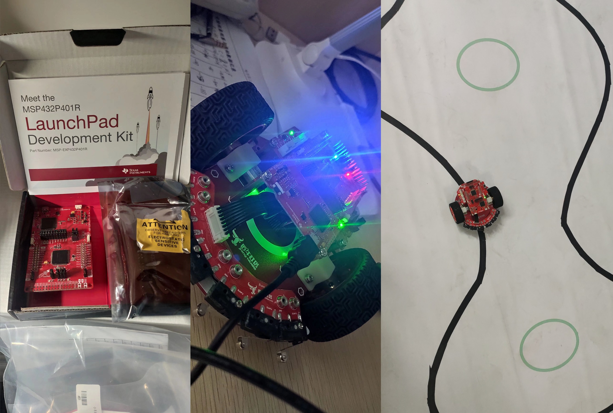

# Line-Following Robot with TI-RSLK

This project implements a high-performance, autonomous line-following robot using the **TI-RSLK Chinese Version**, controlled by an MSP432P401R microcontroller. The robot is engineered to navigate a course marked by a black line on a white surface, demonstrating a complete embedded system that integrates sensor perception, a sophisticated control algorithm, and motor actuation.

As an educational platform, this project is designed to provide a hands-on, "bottom-up" learning experience. It covers fundamental embedded systems concepts including microcontroller architecture, peripheral configuration (GPIO, PWM, Timers, Interrupts), sensor interfacing, and real-time control theory, all within the context of a tangible robotics application.

The firmware is developed in **C** and uses the **TI DriverLib peripheral library** to interface directly with the robot's hardware, ensuring efficient and precise control.

https://github.com/user-attachments/assets/fd2da2f1-7bcd-475e-9a3a-7d33e3da3afc

## Hardware Specifications

| Component             | Specification                           |
| :-------------------- | :-------------------------------------- |
| **Main Controller**   | TI MSP432P401R LaunchPad                |
| **Chassis Material**  | Aluminum Alloy                          |
| **Dimensions**        | 163mm x 160mm x 84mm                    |
| **Tire Diameter**     | 68mm                                    |
| **Motors**            | N20 DC Gear Motors                      |
| **Motor Gear Ratio**  | 1:50                                    |
| **Motor Rated Speed** | 180 rpm                                 |
| **Encoder Signal**    | Quadrature (A/B Phase) Square Wave      |
| **Operating Voltage** | > 7.4V (from 2x 14500 Li-ion batteries) |

---
## Clock System Configuration

The robot's ability to perform tasks in real-time depends on a precise and stable clock system. The firmware carefully configures the MSP432's clocks in a multi-step process to achieve the high performance required for the control algorithms.

1.  **Power and Flash Setup**: Before increasing the clock speed, the firmware first prepares the hardware.
    * The core voltage is increased to **VCORE1** using `MAP_PCM_setCoreVoltageLevel(PCM_VCORE1)`. This higher power mode is required to operate the CPU reliably at its maximum frequency.
    * The Flash memory access speed is adjusted by setting its **wait states** to 1 (`FlashCtl_setWaitState(..., 1)`). This ensures that the memory can keep up with the fast CPU, preventing data corruption.

2.  **Master Clock (MCLK) Configuration**: The **Digitally-Controlled Oscillator (DCO)** is configured as the main clock source. It is set to a centered frequency of **48 MHz** using `CS_setDCOCenteredFrequency(CS_DCO_FREQUENCY_48)`. This 48 MHz signal becomes the Master Clock (MCLK), driving the ARM Cortex-M4F core at its maximum speed.

3.  **Sub-System Master Clock (SMCLK) Configuration**: Most of the robot's peripherals run on the Sub-System Master Clock (SMCLK). The firmware creates this clock by taking the 48 MHz DCO as a source and dividing it by 4, resulting in a stable **12 MHz SMCLK**. This is accomplished with the call:
    `CS_initClockSignal(CS_SMCLK, CS_DCOCLK_SELECT, CS_CLOCK_DIVIDER_4);`

This 12 MHz SMCLK serves as the foundational timepiece for all the robot's critical real-time operations, providing the clock source for all four hardware timers that manage motor PWM, PID calculations, sensor readings, and encoder measurements.

---
## System Overview & Hardware

* **Microcontroller**: The **TI SimpleLink™ MSP432P401R LaunchPad™ Development Kit** is the robot's central processor. It features a powerful 32-bit **ARM Cortex-M4F core** running at **48 MHz**, with **256KB of Flash** memory and **64KB of SRAM**. The LaunchPad includes an on-board **XDS110-ET emulator**, allowing for direct programming and debugging over a single USB cable.

* **Chassis and Motors**: The Chinese version of the kit features an upgraded chassis and motor set.
    * **Chassis**: A red **aluminum alloy chassis** provides a sturdy base for the robot.
    * **Motors**: Two higher-performance **N20 DC gear motors** with a **1:50 gear ratio** drive the robot.
    * **PCBs**: The motor driver and power boards have been redesigned to match the custom chassis.
    * **Control Pins**: Motor speed is controlled via PWM, while direction is set using GPIO pins. **Note:** This project's firmware uses a custom pinout for motor direction (`P1.6` for Right, `P1.7` for Left), which differs from the standard international TI-RSLK user guide mapping.

* **Line Sensor**: An **8-channel infrared (IR) reflectance sensor array** is mounted on the front of the robot to detect the line. During each sensing cycle, the firmware charges the sensor's capacitors by setting the sensor pins (`P7.0`-`P7.7`) as high-voltage outputs. It then switches the pins to inputs and waits for a tuned delay period (`for (i = 0; i < 2500; i++)`) before reading the pins' digital state. This delay is critical for calibrating the sensor's sensitivity.

* **Motor Encoders**: Each N20 motor is coupled with an encoder assembly that outputs a **quadrature (A/B phase) square wave signal**. The firmware uses the MSP432's Timer_A modules in **capture mode** to measure the time between rising edges of the encoder's "A" signal (`P10.4` for Right, `P8.2` for Left). By simultaneously reading the digital state of the "B" signal (`P10.5` for Right, `P9.2` for Left), the firmware can determine the direction of rotation.

---
## Control System and Firmware

The robot's navigation is achieved through an interrupt-driven firmware architecture that implements a dual-PID (Proportional-Integral-Derivative) control system.

### Position PID Controller (Outer Loop)
This controller runs every millisecond and is responsible for steering. In this implementation, it functions as a **Proportional (P) controller**, as the Integral (`kip`) and Derivative (`kdp`) gains are set to zero.

* **Input (Position Error)**: The controller calculates a weighted "position error" from the 8 IR sensor readings. The formula is:
    `err0 = -8*L4 - 4*L3 - 2*L2 - 1*L1 + 1*R1 + 2*R2 + 4*R3 + 8*R4`
* **Output (Speed Adjustment)**: The controller calculates a steering correction using a proportional gain (`kpp = 80.0`). This output adjusts the target speeds for the left and right motors:
    `velocityL = (base_velocity + out)`
    `velocityR = (base_velocity - out)`

### Velocity PID Controllers (Inner Loop)
Two independent PID controllers—one for each motor—run within the same millisecond loop to ensure the motors spin at the exact target speed dictated by the position controller.

* **Input (Velocity Error)**: Each controller calculates its error by subtracting the motor's *actual speed* from its *target speed*: `eL0 = velocityL - speedL`.
* **Output (PWM Duty Cycle)**: Based on the velocity error, the PID controller calculates a new output value using its gains (`kp=3.5`, `ki=0.0015`, `kd=300.0`). This value is then translated into the PWM duty cycle for the motor, **clamped between 0 and 599** to match the timer's period.

---
## Timers and Interrupts: The Robot's Heartbeat

The firmware's real-time performance relies on the precise scheduling of tasks using the MSP432's hardware timers and the Nested Vectored Interrupt Controller (NVIC). The system uses four Timer_A modules, each configured for a specific role.

### Timer_A0: Motor PWM Generation
* **Purpose**: Provides continuous, hardware-driven PWM signals to the motor drivers for precise speed control.
* **Configuration**: The timer is configured in **UpDown mode**, counting from 0 up to a period of 600 and back down to 0. Sourced from the 12 MHz SMCLK, this results in a **10 kHz center-aligned PWM frequency** ($12 \text{ MHz} / (2 \times 600)$).
* **Output**: The duty cycle for the right motor (`P2.6`) and left motor (`P2.7`) are controlled by compare registers `CCR3` and `CCR4`, respectively.
* **Interrupts**: This timer **does not generate interrupts**; its operation is entirely handled by the hardware.

### Timer_A1: Main Control Loop Interrupt
* **Purpose**: Acts as the system's primary scheduler, triggering the core PID control logic at a fixed rate.
* **Configuration**: Configured in **Up mode** with its clock sourced from SMCLK divided by 4 (3 MHz). The period is set to 3000 ticks, which generates a precise **1 ms periodic interrupt**.
* **Interrupt Service Routine (`TA1_0_IRQHandler`)**: This is the robot's "brain." On each 1 ms tick, this ISR executes the entire control strategy:
    1.  Calculates the line position error.
    2.  Runs the position PID algorithm to determine the new `velocityL` and `velocityR` targets.
    3.  Calculates the velocity error for each motor.
    4.  Runs both velocity PID algorithms to determine the required PWM output values.
    5.  Updates the compare registers of Timer_A0 with the new duty cycle values.

### Timer_A2: Sensor Reading and Speed Calculation
* **Purpose**: Periodically reads the line sensors and processes the raw timing data from the encoders into a usable speed value.
* **Configuration**: Configured in **Up mode** using the 12 MHz SMCLK. Its period is set to 36,000 ticks, resulting in a **3 ms interrupt period**.
* **Interrupt Service Routine (`TA2_0_IRQHandler`)**: On each 3 ms tick, this ISR performs the following:
    1.  Initiates the IR sensor reading by charging and then discharging the sensor capacitors.
    2.  Reads the digital state of all 8 sensor pins.
    3.  Calculates the final wheel speeds in pulses-per-second using the latest data captured by Timer_A3.
    4.  Resets the encoder pulse counters for the next measurement interval.

### Timer_A3: Encoder Speed Capture
* **Purpose**: Measures the raw time between encoder pulses for both motors.
* **Configuration**: Configured in **Continuous mode** with a **6 MHz** clock source (SMCLK/2). This allows it to act as a free-running, high-resolution timestamp counter. Two separate capture channels are configured to trigger on a rising edge from the encoder signals.
* **Interrupt Service Routines (`TA3_0_IRQHandler` & `TA3_N_IRQHandler`)**: This timer uses two ISRs, one for each motor encoder. When an encoder pulse triggers a capture event:
    1.  The firmware reads the 'B' signal pin to determine direction.
    2.  It captures the timer's current count value (the timestamp).
    3.  It increments or decrements the appropriate pulse counter (`counterL` or `counterR`).

### Other Interrupts
* **GPIO (`PORT1_IRQHandler`)**: An interrupt is configured on the LaunchPad's push button (`P1.1`) to toggle a global `BEGIN` flag, which in turn enables or disables the main Timer_A1 control loop interrupt, effectively starting and stopping the robot.
* **UART (`EUSCIA0_IRQHandler`, etc.)**: Interrupts are enabled for the UART modules to handle asynchronous serial communication for debugging without blocking the main processor.
